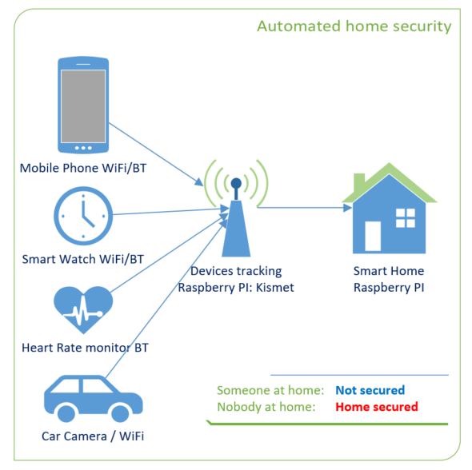
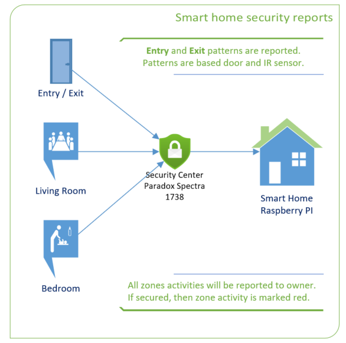

# Smart Home and Automation
Smart Home and Automation based in Raspberry PI 

## Smart Home main screen
The Smart Home management device is obviously mobile phone. The interface is built on PowerApps.

## Smart people recognition
People carry their mobile phone and smart watch most of the time. Based these mobile devices
this smart home will mark persons at home or away. 

This functionality is based on another Raspberry PI which has an operating system Kali and 
device tracking is done by software named Kismet.

This device tracking functionality enables Smart Security feature. 
If nobody is at home then home is automatically secured.

## Smart Door
Based on the patterns is possible to recognize the direction of the movement.
This functionality is based on door magnetic sensor and entry infrared sensor.

## Smart Security
If nobody is at home then home is automatically secured. 
If known people arrived then home is automatically unsecured. Known people are recognized based their 
mobile phones, smart watches or by car.

"Secured home" mean that the owner will get immediately an e-mail if someone moves around.
All zones activities during secured time are marked red.

## Smart Heating
Energy price is changing hourly basis and it is known one day ahead.
Based on the real time energy price and weather forecast the heating schedule 
is calculated automatically for each day. Calculation is based on AI (artificial intelligence) component.

## Smart Home Reports
Reports are showing temepratures inside/outside. How many minutes the heating system has spent 
for heating and for hot water.

Other reports about humidity, noice, CO2 and minutes of ventilation working time.

